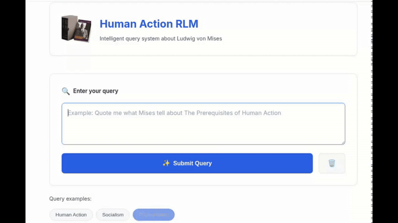

<div align="center">


# Recursive Language Model for Human Action



</div>

[Link to the official RLM codebase](https://github.com/alexzhang13/rlm)

[Link to the paper](https://arxiv.org/abs/2512.24601v1)

[Link to the original blogpost 📝](https://alexzhang13.github.io/blog/2025/rlm/)

---

**Human Action** by Ludwig von Mises is a monumental and profoundly complex work spanning over 900 pages of dense economic theory, philosophy, and social analysis. What better opportunity to explore and learn from Mises's masterpiece than by leveraging cutting-edge technology designed to process massive digital texts?

This project harnesses the power of **Recursive Language Models (RLM)**, an innovative architecture that enables deep, contextual understanding of enormous documents. By processing the entirety of "Human Action," this system allows users to query, explore, and engage with Mises's ideas in an interactive and meaningful way. Whether you're a student of Austrian economics, a researcher, or simply curious about praxeology, this tool transforms a challenging read into an accessible, conversational experience.

## Installation

Clone the repository and install the required dependencies:

```bash
git clone https://github.com/mateolafalce/human-action-rlm.git
cd human-action-rlm
pip install -r requirements.txt
```

### Environment Configuration

Before running the server, you need to configure your environment variables:

1. Copy the example environment file:
   ```bash
   cp .env-example .env
   ```

2. Edit the `.env` file and add your API keys:
   ```
   # OpenAI API Key (required)
   OPENAI_API_KEY=your_openai_api_key_here
   
   # Optional: Custom port (defaults to 5000)
   PORT=5000
   ```

## Running the Server

To start the application server:

```bash
python3 main.py
```

On first run, the application will:
1. Download the full text of "Human Action" from mises.org (if not already cached)
2. Initialize the RLM with the book as context
3. Start the Flask web server

Once running, you can access: `http://localhost:5000`

The server will display startup messages indicating when the book is loaded and the RLM is ready to accept queries.

